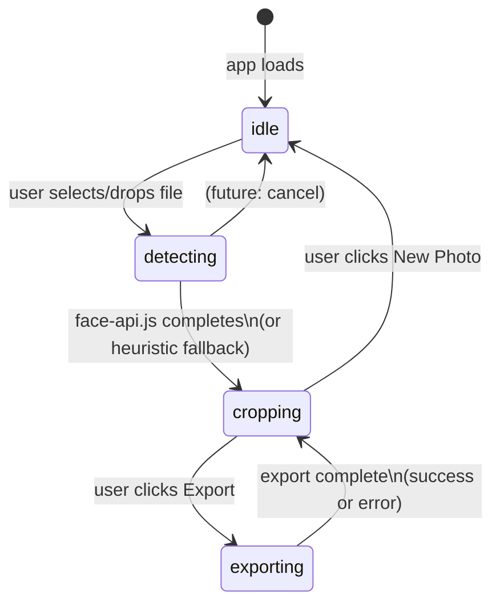
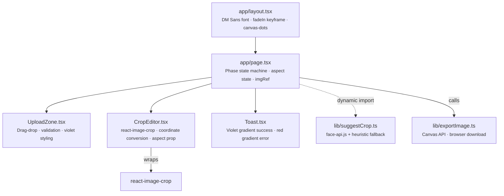
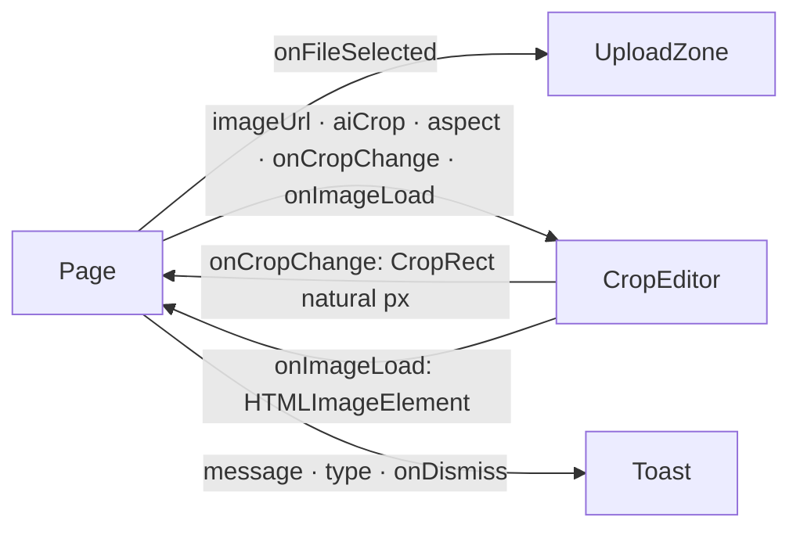
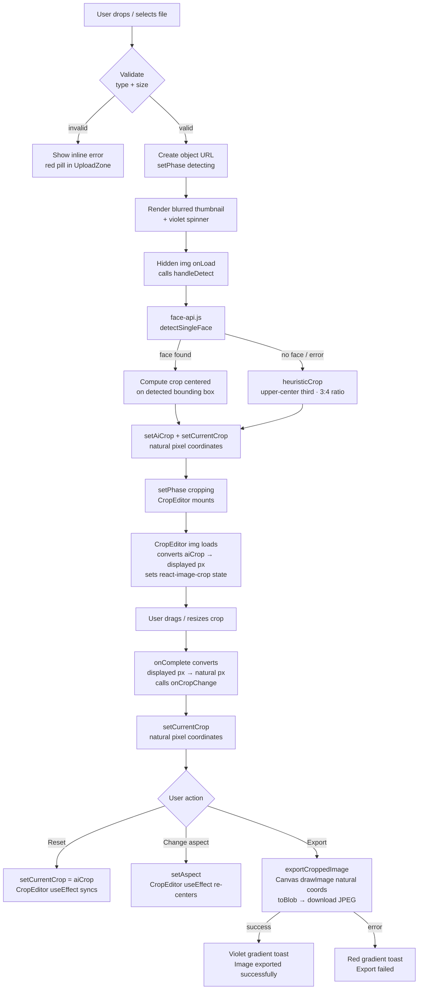
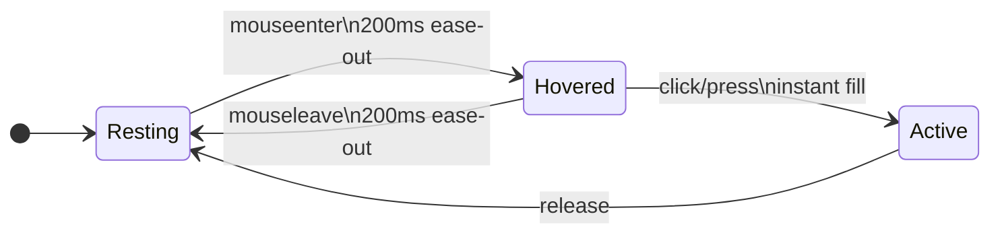

# Production UI Redesign — Design Document
**Date:** 2026-04-09  
**Style:** Canva-inspired · Soft gradient · Frosted glass · DM Sans  

---

## Table of Contents
1. [App State Machine](#1-app-state-machine)
2. [Layout Wireframes](#2-layout-wireframes)
3. [Component Architecture](#3-component-architecture)
4. [Data Flow](#4-data-flow)
5. [Color System](#5-color-system)
6. [Typography](#6-typography)
7. [Transitions & Motion](#7-transitions--motion)
8. [Component Specs](#8-component-specs)
9. [Files Changed](#9-files-changed)

---

## 1. App State Machine

The entire app is driven by a single `phase` state in `page.tsx`.



**Phase meanings:**

| Phase | What renders |
|---|---|
| `idle` | Upload zone centered on gradient background |
| `detecting` | Blurred thumbnail + violet spinner + "Detecting face…" pill |
| `cropping` | Canvas with crop editor + frosted sidebar (desktop) or bottom bar (mobile) |
| `exporting` | Same as cropping — Export button pulses, disabled |

---

## 2. Layout Wireframes

### Desktop (≥768px)

```
┌─────────────────────────────────────────────────────────────┐
│  HEADER  bg-white/80 backdrop-blur-md  h-14                 │
│  ┌──────────────────┐          ┌────────────────────────┐   │
│  │ 🟣 Headshot      │          │ Reset  New photo  Export│   │
│  │    Cropper       │          └────────────────────────┘   │
│  └──────────────────┘                                       │
├──────────────────────────────────────┬──────────────────────┤
│                                      │  SIDEBAR  w-64       │
│   CANVAS  bg-[#f8f7ff]  canvas-dots  │  bg-white/70         │
│                                      │  backdrop-blur-xl    │
│                                      │                      │
│         ┌───────────────┐            │  ASPECT RATIO        │
│         │               │            │  ┌──────┬──────┐     │
│         │  crop image   │            │  │ Free │  1:1 │     │
│         │  shadow-2xl   │            │  ├──────┼──────┤     │
│         │               │            │  │  3:4 │  4:5 │     │
│         └───────────────┘            │  └──────┴──────┘     │
│                                      │                      │
│                                      │  ACTIONS             │
│                                      │  [Reset to AI]       │
│                                      │                      │
│                                      │  ─────────────────   │
│                                      │  Drag handles to     │
│                                      │  adjust. Export      │
│                                      │  saves full-res JPEG │
└──────────────────────────────────────┴──────────────────────┘
```

### Mobile (<768px)

```
┌─────────────────────────┐
│  HEADER  h-14           │
│  🟣 Headshot  [Export]  │
├─────────────────────────┤
│                         │
│  CANVAS  bg-[#f8f7ff]   │
│  canvas-dots            │
│                         │
│   ┌─────────────────┐   │
│   │   crop image    │   │
│   │   shadow-2xl    │   │
│   └─────────────────┘   │
│                         │
├─────────────────────────┤
│  BOTTOM BAR  fixed      │
│  bg-white/80            │
│  backdrop-blur-xl       │
│  ┌──┬──┬──┬──┐          │
│  │Fr│1:1│3:4│4:5│  ←aspect│
│  └──┴──┴──┴──┘          │
│  [Reset]  [  Export  ]  │
└─────────────────────────┘
```

### Upload State (all breakpoints)

```
┌─────────────────────────────────────────────┐
│  HEADER                                     │
├─────────────────────────────────────────────┤
│                                             │
│         Upload your photo                  │
│    AI detects the face and suggests…        │
│                                             │
│   ┌ ─ ─ ─ ─ ─ ─ ─ ─ ─ ─ ─ ─ ─ ─ ─ ─ ─ ┐  │
│   │       bg-violet-50/50                │  │
│   │     border-violet-200 dashed         │  │
│   │                                      │  │
│   │          ┌────────┐                  │  │
│   │          │ violet │  gradient icon   │  │
│   │          │  icon  │                  │  │
│   │          └────────┘                  │  │
│   │                                      │  │
│   │  Drop your photo here, or browse     │  │
│   │  JPEG · PNG · WebP · max 10 MB       │  │
│   └ ─ ─ ─ ─ ─ ─ ─ ─ ─ ─ ─ ─ ─ ─ ─ ─ ─ ┘  │
│                                             │
└─────────────────────────────────────────────┘
```

---

## 3. Component Architecture



**Prop flow:**



---

## 4. Data Flow



---

## 5. Color System

### Palette

```
Page Background ──── linear-gradient(135deg)
  #f5f3ff ──────────────────── violet-50
     │
  #faf5ff ──────────────────── faint lavender mid
     │
  #ffffff ──────────────────── white

Canvas ──────────── #f8f7ff (violet-tinged white)
  Dot grid ────────── #ede9fe (violet-100) 1.5px dots, 22px grid

Primary ─────────── violet-600  #7C3AED
Hover ───────────── violet-700  #6D28D9
Gradient ────────── from-violet-600 to-purple-600

Frosted glass:
  Header ──────────── bg-white/80  backdrop-blur-md
  Sidebar ─────────── bg-white/70  backdrop-blur-xl
  Bottom bar ──────── bg-white/80  backdrop-blur-xl

Text:
  Primary ─────────── gray-900  #111827
  Secondary ───────── gray-500  #6B7280
  Hint ────────────── gray-400  #9CA3AF
  Accent ──────────── violet-500 #8B5CF6

Shadows:
  Logo badge ──────── shadow-md shadow-violet-500/30
  Primary button ──── shadow-md shadow-violet-500/25
  Active aspect btn── shadow-md shadow-violet-500/30
  Crop image ──────── shadow-2xl shadow-black/25
  Sidebar ─────────── shadow-xl shadow-violet-100/20
  Toast ───────────── shadow-xl (color-matched)
```

### Token Table

| Token | Value | Usage |
|---|---|---|
| Page background | `135deg, #f5f3ff → #faf5ff → #ffffff` | Full-page gradient |
| Canvas background | `#f8f7ff` | Editor canvas area |
| Canvas dot grid | `#ede9fe` 1.5px, 22px grid | CSS radial-gradient pattern |
| Primary accent | `violet-600` (`#7C3AED`) | Buttons, active states, icons |
| Primary gradient | `from-violet-600 to-purple-600` | Logo badge, toasts |
| Text primary | `gray-900` | Headings, labels |
| Text secondary | `gray-500` | Subtitles, descriptions |
| Text hint | `gray-400` | Placeholder text |
| Text accent | `violet-500` | Sidebar section labels |
| Header bg | `bg-white/80 backdrop-blur-md` | Frosted glass header |
| Sidebar bg | `bg-white/70 backdrop-blur-xl` | Frosted glass sidebar |
| Mobile bar bg | `bg-white/80 backdrop-blur-xl` | Frosted glass bottom bar |

---

## 6. Typography

**Font:** DM Sans (Google Fonts) — weights 400, 500, 600  
Loaded via `next/font/google`, applied via CSS variable `--font-dm-sans`.

```
DM Sans 600 ── App name (text-sm), page heading (text-2xl),
               button labels (text-xs), section labels (text-[10px] uppercase)
DM Sans 500 ── Nav actions (text-xs)
DM Sans 400 ── Body text (text-sm), hints (text-xs)
```

| Role | Class | Weight |
|---|---|---|
| App name in header | `text-sm font-semibold tracking-tight` | 600 |
| Page heading (upload) | `text-2xl font-semibold tracking-tight` | 600 |
| Page subtitle | `text-sm` | 400 |
| Sidebar section label | `text-[10px] font-semibold uppercase tracking-widest text-violet-500` | 600 |
| Button (primary) | `text-xs font-semibold` | 600 |
| Button (secondary) | `text-xs font-medium` | 500 |
| Hint text | `text-[10px] text-gray-400` | 400 |

---

## 7. Transitions & Motion



| Trigger | Animation | Duration | Easing |
|---|---|---|---|
| Phase change (idle/detecting/cropping) | `opacity 0→1, translateY 6px→0` (fadeIn) | 300ms | `ease-out` |
| Any button / interactive element | `transition-all` | 200ms | `ease-out` |
| Upload zone drag-over | `scale 1→1.01`, border+bg color | 150ms | `ease-out` |
| Upload icon on drag | `scale 1→1.1` | 200ms | `ease-out` |
| Aspect button activation | background fill | 200ms | `ease-out` |
| Toast entrance | `opacity 0→1, translateY 0` | 300ms | CSS default |
| Toast exit | `opacity 1→0, translateY 0→2` | 300ms | CSS default |
| Export button (exporting) | `animate-pulse` | ∞ loop | Tailwind default |

---

## 8. Component Specs

### Header

```
h-14 | bg-white/80 backdrop-blur-md | border-b border-white/60 | shadow-sm | z-10
├── Logo badge: w-8 h-8 · rounded-xl · bg-gradient-to-br from-violet-600 to-purple-600
│              shadow-md shadow-violet-500/30
│   └── SVG icon: w-4 h-4 · text-white · strokeWidth 2.2
├── App name: text-sm font-semibold text-gray-900 tracking-tight
└── Right actions (cropping phase only):
    ├── "Reset crop" (sm+): text-xs font-medium · hover:text-violet-600 · hover:bg-violet-50
    ├── "New photo": same styling
    └── "Export" button: bg-violet-600 · px-4 py-1.5 · rounded-lg
                         shadow-md shadow-violet-500/25
                         animate-pulse when exporting
```

### Upload Zone

```
UploadZone (max-w-sm container in page)
└── Drop area: rounded-3xl · border-2 border-dashed · py-10 px-6
    ├── Default: border-violet-200 · bg-violet-50/50
    └── Drag-over: border-violet-500 · bg-violet-100/60 · scale-[1.01]
    
    ├── Icon container: w-14 h-14 · rounded-2xl
    │   ├── Default: bg-gradient-to-br from-violet-500 to-purple-600 · shadow-violet-500/25
    │   └── Drag-over: shadow-violet-500/40 · scale-110
    │   └── Upload SVG: w-6 h-6 · text-white · strokeWidth 2
    
    └── Text:
        ├── Primary: text-sm font-semibold text-gray-800
        │   └── "browse files" span: text-violet-600 underline underline-offset-2
        └── Hint: text-xs text-gray-400

Error state:
└── text-xs font-medium text-red-500 · bg-red-50 · rounded-xl · border border-red-100
```

### Detecting State

```
Centered in flex-1 canvas area
└── Thumbnail: rounded-2xl · opacity-40 · maxHeight 52vh · maxWidth min(90vw, 360px)
    └── Overlay (absolute inset):
        ├── Spinner container: w-10 h-10 · rounded-full · bg-white/90 · shadow-lg
        │   └── SVG spinner: w-5 h-5 · text-violet-600 · animate-spin
        └── Label pill: text-xs font-semibold text-gray-700
                        bg-white/90 backdrop-blur-sm · px-3 py-1.5 · rounded-full · shadow-sm

Hidden  (className="hidden") triggers handleDetect onLoad
```

### Canvas Area

```
flex-1 · bg-[#f8f7ff] · canvas-dots · overflow-hidden · p-6 sm:p-10

canvas-dots (from globals.css):
  background-image: radial-gradient(circle, #ede9fe 1.5px, transparent 1.5px)
  background-size: 22px 22px
```

### CropEditor (inside canvas)

```
ReactCrop wrapper: rounded-2xl · overflow-hidden · shadow-2xl shadow-black/25
└── : maxHeight min(62vh, 580px) · maxWidth min(100%, 560px) · width auto

Coordinate system:
  aiCrop (in)  ──── natural pixel space (from suggestCrop)
       │
       ▼ toDisplay() on img load (scale by img.width/naturalWidth)
  react-image-crop ── displayed pixel space internally
       │
       ▼ onComplete() scale by naturalWidth/img.width
  onCropChange (out) ── natural pixel space (for export)
```

### Sidebar (desktop `w-64`)

```
bg-white/70 · backdrop-blur-xl · border-l border-white/50
shadow-xl shadow-violet-100/20

├── Aspect Ratio section (border-b border-violet-50):
│   ├── Label: text-[10px] font-semibold text-violet-500 uppercase tracking-widest
│   └── 2×2 grid buttons:
│       ├── Inactive: border border-violet-100 · text-gray-500
│       │            hover:border-violet-300 · hover:text-violet-600 · hover:bg-violet-50
│       └── Active: bg-violet-600 · text-white · shadow-md shadow-violet-500/30 · scale-[1.02]
│
├── Actions section:
│   ├── Label: text-[10px] font-semibold text-violet-500 uppercase tracking-widest
│   └── Reset button: border border-violet-200 · text-violet-600 · rounded-xl · py-2.5
│                     hover:bg-violet-50 · hover:border-violet-400
│
└── Footer hint (mt-auto):
    text-[10px] text-gray-400 centered leading-relaxed
```

### Mobile Bottom Bar

```
fixed bottom-0 inset-x-0 · bg-white/80 backdrop-blur-xl
border-t border-white/50 · shadow-lg · z-10 · pt-3 pb-5 px-4

├── Aspect pills row (gap-1.5):
│   ├── Inactive: border border-violet-100 · text-gray-500
│   └── Active: bg-violet-600 · text-white · shadow-md shadow-violet-500/30
│
└── Action row:
    ├── Reset: text-violet-600 · border border-violet-200 · rounded-xl
    └── Export: flex-1 · bg-violet-600 · text-white · shadow-md shadow-violet-500/25
                animate-pulse when exporting
```

### Toast

```
fixed bottom-6 right-6 · z-50 · rounded-2xl · shadow-xl
flex items-center gap-3 · px-4 py-3 · text-xs font-semibold text-white
transition-all duration-300

├── Success: bg-gradient-to-r from-violet-600 to-purple-600 · shadow-violet-500/30
└── Error:   bg-gradient-to-r from-red-500 to-rose-600 · shadow-red-500/30

├── Icon: w-5 h-5 rounded-full bg-white/20 · w-3 h-3 SVG inside
└── Message text

Exit animation: opacity-0 + translate-y-2 over 300ms
```

---

## 9. Files Changed

| File | Change |
|---|---|
| `app/layout.tsx` | Replaced Geist → DM Sans (weights 400/500/600), CSS variable on `<body>` |
| `app/globals.css` | Added `@keyframes fadeIn`, `.animate-fadeIn`, `.canvas-dots` utilities |
| `app/page.tsx` | Full redesign — gradient bg, frosted header/sidebar, phase transitions, violet accents |
| `components/UploadZone.tsx` | Violet gradient upload zone, drag-over animation |
| `components/CropEditor.tsx` | `shadow-2xl shadow-black/25` on ReactCrop wrapper |
| `components/Toast.tsx` | Violet gradient success, red-rose gradient error, slide-up exit |

### Git log

```
7001dfe  design: violet gradient success toast, red gradient error toast
c906600  design: richer shadow on crop image
4cc773a  design: violet gradient upload zone with drag-over animation
d8eacf6  design: violet gradient, frosted header/sidebar, fadeIn transitions
64f3765  design: swap to DM Sans font, add fadeIn animation and canvas-dots utility
```
